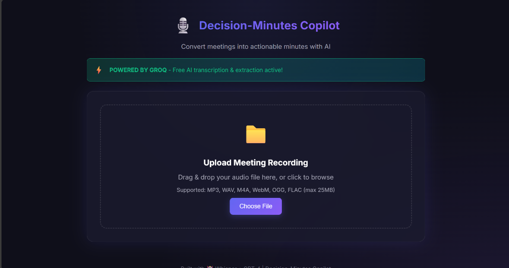
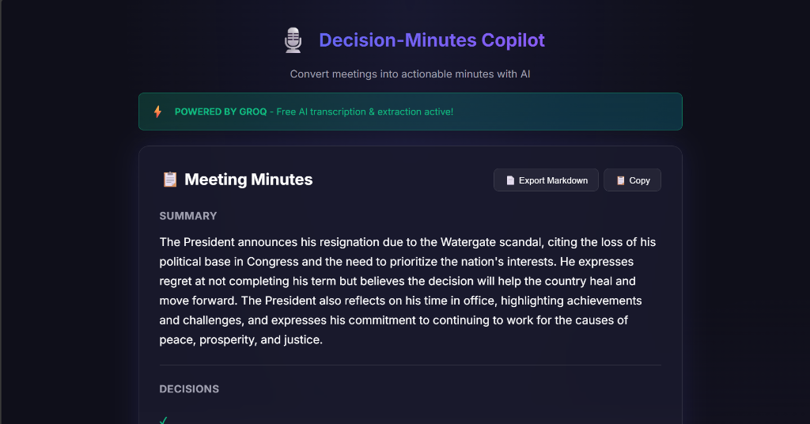

# Decision-Minutes Copilot

An AI-powered tool that converts meeting recordings into actionable minutes.

## Live Demo

Try it here: https://decision-minutes-copilot.onrender.com

## What it does

- Upload audio/video files of meetings
- Transcribes speech to text using Whisper AI
- Extracts key decisions and action items
- Shows confidence scores for each item
- Export results to markdown

## Tech Stack

- Python / Flask
- Groq API (Whisper + LLaMA)
- HTML, CSS, JavaScript

## How to Run Locally

```bash
# Clone the repo
git clone https://github.com/Dewashish14xxx/decision-minutes-copilot.git
cd decision-minutes-copilot

# Create virtual environment
python -m venv venv
venv\Scripts\activate  # Windows

# Install dependencies
pip install -r requirements.txt

# Set up environment
copy .env.example .env
# Add your GROQ_API_KEY to .env (get free key from console.groq.com)

# Run
python -m app.main
```

Then open http://localhost:5000

## Screenshots




## Author

Dewashish

## License

MIT
