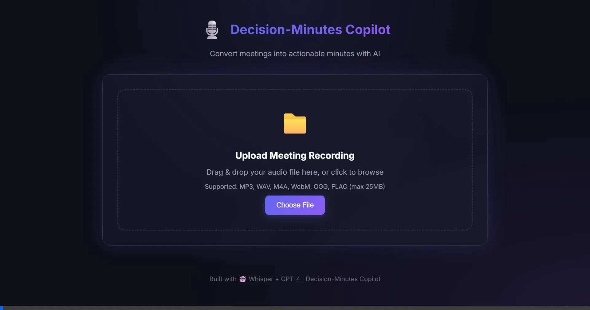
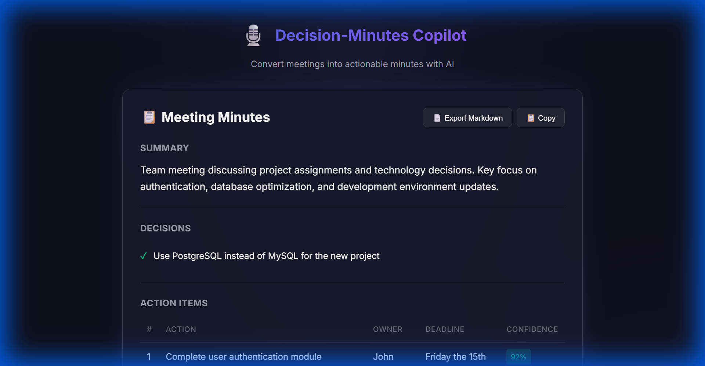
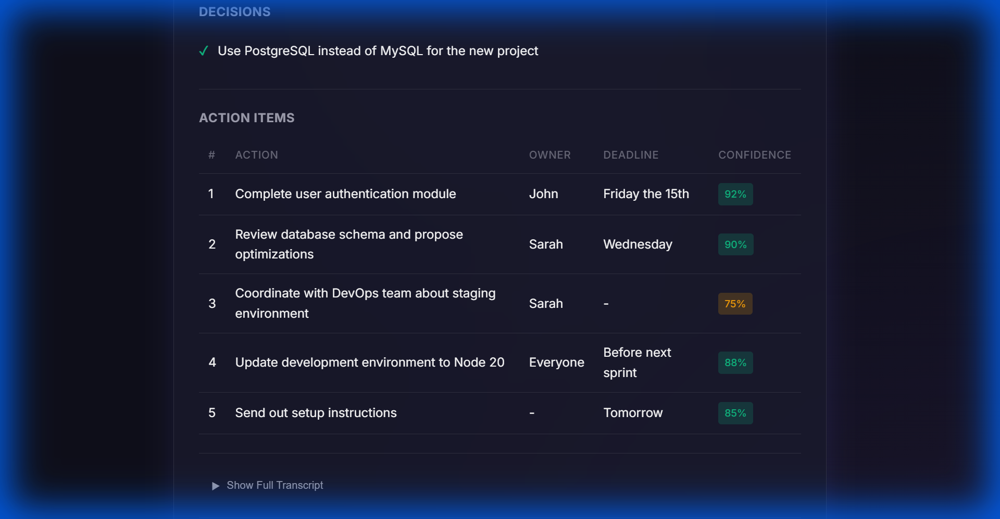

# Decision-Minutes Copilot

🎙️ **Convert meeting recordings into actionable minutes with AI - 100% FREE**


## 🎬 Demo



## 📸 Screenshots

### Upload Interface


### Powered by Groq (FREE AI)


### AI-Extracted Results


### Action Items with Confidence Scores


## 🚀 Features

| Feature | Technology | Cost |
|---------|------------|------|
| Audio Upload | Drag & Drop | Free |
| Speech-to-Text | Groq Whisper | **FREE** |
| Action Extraction | Groq LLaMA 3.3 70B | **FREE** |
| Confidence Scoring | AI-generated | Free |
| Human Confirmation | Built-in | Free |
| Export to Markdown | Built-in | Free |

## 📊 Performance

| Metric | Value |
|--------|-------|
| Transcription Model | Whisper Large v3 |
| Extraction Model | LLaMA 3.3 70B |
| Processing Speed | ~10x faster (Groq) |
| Cost per Request | **$0.00** |

## 🛠️ Setup

```bash
# Clone the repo
git clone https://github.com/Dewashish14xxx/decision-minutes-copilot.git
cd decision-minutes-copilot

# Create virtual environment
python -m venv venv
venv\Scripts\activate  # Windows

# Install dependencies
pip install -r requirements.txt

# Set up environment (get FREE key from console.groq.com)
copy .env.example .env
# Add your GROQ_API_KEY to .env

# Run the app
python -m app.main
```

Open http://localhost:5000 and upload a meeting recording!

## 📁 Project Structure

```
decision-minutes-copilot/
├── app/
│   ├── main.py          # Flask entry point
│   ├── routes.py        # API endpoints
│   └── services/
│       ├── transcription.py  # Groq Whisper
│       └── extraction.py     # Groq LLaMA
├── static/              # CSS & JS
├── assets/              # Screenshots & demo
├── evals/               # Test cases
└── uploads/             # Temporary storage
```

## 🔑 Get Your FREE API Key

1. Go to https://console.groq.com
2. Sign up (no credit card required)
3. Create an API key
4. Add to `.env` file

## 📝 License

MIT

